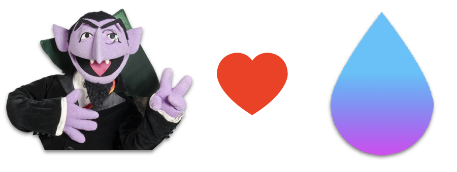

# GraphZahl Vapor Support

A set of extensions that allow to use [GraphZahl](https://github.com/nerdsupremacist/GraphZahl) with [Vapor](https://vapor.codes).

## About GraphZahl

GraphZahl is a Framework to implement Declarative, Type-Safe GraphQL Server APIs with Magic 🎩.
Learn more about GraphZahl: [here](https://github.com/nerdsupremacist/GraphZahl)

## Installation
### Swift Package Manager

You can install GraphZahl via [Swift Package Manager](https://swift.org/package-manager/) by adding the following line to your `Package.swift`:

```swift
import PackageDescription

let package = Package(
    [...]
    dependencies: [
        .package(url: "https://github.com/nerdsupremacist/GraphZahl.git", majorVersion: XYZ)
        
        // It is recommended to use GraphZahl alongside Vapor
        .package(url: "https://github.com/nerdsupremacist/graphzahl-vapor-support.git", majorVersion: XYZ)
    ]
)
```

## Usage

You can now add a Schema direetly to your APPs Routes:

```swift
enum HelloWorld: GraphQLSchema {
    class Query: QueryType {
        func greeting(name: String) -> String {
            return "Hello, \(name)"
        }
    }

    typealias Mutation = None
}

// Add the API to the Routes of your Vapor App
app.routes.graphql(path: "api", "graphql", use: HelloWorld.self)
```

And you can even add GraphiQL:

```swift
app.routes.graphql(path: "api", "graphql", use: HelloWorld.self, includeGraphiQL: true)
```

And in case you need to provide a ViewerContext, just pass a closure, that describes how to get the ViewerContext from the Request:

```swift
enum TodoApp: GraphQLSchema {
    typealias ViewerContext = LoggedInUser?

    class Query: QueryType {
        let user: LoggedInUser?
        
        func myTodos() -> [Todo]? {
            return user?.todosFromDB()
        }

        required init(viewerContext user: LoggedInUser?) {
            self.user = user
        }
    }

    typealias Mutation = None
}

app.routes.graphql(path: "api", "graphql", use: TodoApp.self, includeGraphiQL: true) { $0.db }
```

## Contributions
Contributions are welcome and encouraged!

## License
graphzahl-vapor-support is available under the MIT license. See the LICENSE file for more info.

This project is being done under the supervision of the Chair for Applied Software Enginnering at the Technical University of Munich. The chair has everlasting rights to use and maintain this tool.
